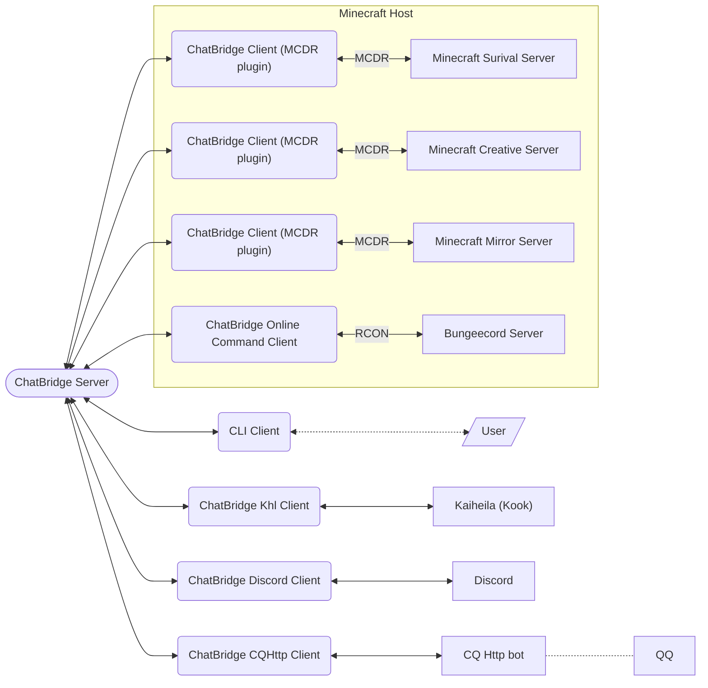

# ChatBridge

> Broadcast chat between Minecraft servers or even discord server

See [here](https://github.com/TISUnion/ChatBridge/tree/v1) for chatbridge v1. **NOT compatible with Chatbridge v1**



## Disclaimer

ChatBridge is mainly for custom use of TIS server, especially the bot/command components:

- CQHttp client
- Discord client
- Kaiheila client
- Online command client

Therefore, for these bot and related clients:

- Expect hardcoded constants in codes and lack of document/usage/support
- PRs for features will not be accepted, issues complaining something don't work will probably be ignored. No after-sales support
- If you want more features, fork this repository and implement them yourself

But the basic chatbridge components are within the support range, including:

- CLI client
- CLI server
- MCDR plugin 

## 免责声明

ChatBridge 是一个为 TIS 服务器定制使用的工具，尤其是 bot/指令相关的组件：

- CQHttp 客户端
- Discord 客户端
- Kaiheila 客户端
- Online 指令客户端

因此，对于这些 bot 及相关的客户端：

- 代码中将会包含若干硬编码常量，缺乏相关的文档/用法等支持
- 功能方面的 PR 不会被接受，相关的 issue 大概率会被忽略，没有售后
- 如果你想要更多的功能，建议你去 fork 这个仓库，然后自己实现

但基本的 ChatBridge 组件都是在支持范围内，这包括：

- CLI 客户端
- CLI 服务端
- MCDR 插件 

## Usage

Enter `python ChatBridge.pyz` in command line to see possible helps

At launch, if the configure file is missing, chatbridge will automatically generate a default one and exit

## Requirement

Python 3.6+ required

Requirements stored in `requirements.txt`, use `pip install -r requirements.txt` to install

```
mcdreforged>=2.2.0
pycryptodome
colorlog
```

## CLI Server

```
python ChatBridge.pyz server
```

Configure:

```json5
{
    "aes_key": "ThisIstheSecret",  // the common encrypt key for all clients
    "hostname": "localhost",  // the hostname of the server. Set it to "0.0.0.0" for general binding
    "port": 30001,  // the port of the server
    "clients": [  // a list of client
        {
            "name": "MyClientName",  // client name
            "password": "MyClientPassword"  // client password
        }
    ]
}
```

## CLI Client

```
python ChatBridge.pyz client
```

Configure:

```json5
{
    "aes_key": "ThisIstheSecret",  // the common encrypt key
    "name": "MyClientName",  // the name of the client
    "password": "MyClientPassword",  // the password of the client
    "server_hostname": "127.0.0.1",  // the hostname of the server
    "server_port": 30001  // the port of the server
}
```

## [MCDReforged](https://github.com/Fallen-Breath/MCDReforged) plugin client

Required MCDR >=2.2

Just put the `.pyz` file into the plugin folder

Extra configure fields (compared to [CLI client](#cli-client))

```json5
    "enable": true,  // for switching the functionality of the chatbridge plugin
    "debug": false,  // for switching debug logging on
```

## Discord bot client

`python ChatBridge.pyz discord_bot`

Extra requirements (also listed in `/chatbridge/impl/discord/requirements.txt`):

```
discord.py>=2.0.0
```

Extra configure fields (compared to [CLI client](#cli-client))

```json5
    "bot_token": "your.bot.token.here",  // the token of your discord bot
    "channels_for_command": [  // a list of channels, public commands can be used here
        123400000000000000,
        123450000000000000
    ],
    "channel_for_chat": 123400000000000000,  // the channel for chatting and private commands
    "command_prefix": "!!",
    "client_to_query_stats": "MyClient1",  // it should be a client as an MCDR plugin, with stats_helper plugin installed in the MCDR
    "client_to_query_online": "MyClient2"  // a client described in the following section "Client to respond online command"
```

### Commands

`!!stats` will send command to `MyClient1` to query the StatsHelper plugin in the specific client for data

`!!online` will send command to `MyClient2` to use rcon to get `glist` command reply in bungeecord server

## Client as a CoolqHttp client

```
python ChatBridge.pyz cqhttp_bot
```

Extra requirements (also listed in `/chatbridge/impl/cqhttp/requirements.txt`):

```
websocket>=0.2.1
websocket-client>=1.2.1
```

Needs any CoolQ Http protocol provider to work. e.g. [go-cqhttp](https://github.com/Mrs4s/go-cqhttp)

Due to lack of channel division in QQ group (not like discord), to prevent message spam player needs to use special command to let the bot recognize the message:

- In MC (othe client) use `!!qq <message>` to send message to QQ
- In QQ use `!!mc <message>` to send message

Type `!!help` in QQ for more help

Extra configure fields (compared to [CLI client](#cli-client))

`ws_address`, `ws_port` and `access_token` are the same as the value in the config file of coolq-http-api

```json5
    "ws_address": "127.0.0.1",
    "ws_port": 6700,
    "access_token": "access_token.here",
    "react_group_id": 12345,  // the target QQ group id
    "client_to_query_stats": "MyClient1",  // it should be a client as an MCDR plugin, with stats_helper plugin installed in the MCDR
    "client_to_query_online": "MyClient2",  // a client described in the following section "Client to respond online command"
    "server_display_name": "TIS"  // The name of the server, used for display in some places
```

## Kaiheila bot client

`python ChatBridge.pyz kaiheila_bot`

Extra requirements (also listed in `/chatbridge/impl/kaiheila/requirements.txt`):

```
khl.py==0.0.10
```

Extra configure fields (compared to [CLI client](#cli-client))

```json5
    "client_id": "",  // kaiheila client id
    "client_secret": "",  // kaiheila client secret
    "token": "",  // kaiheila token
    "channels_for_command": [  // a list of channels, public commands can be used here. use string
        "123400000000000000",
        "123450000000000000"
    ],
    "channel_for_chat": "123400000000000000",  // the channel for chatting and private commands. use string
    "command_prefix": "!!",
    "client_to_query_stats": "MyClient1",  // it should be a client as an MCDR plugin, with stats_helper plugin installed in the MCDR
    "client_to_query_online": "MyClient2",  // a client described in the following section "Client to respond online command"
    "server_display_name": "TIS"  // The name of the server, used for display in some places
```

## Client to respond online command

```
python ChatBridge.pyz online_command
```

Extra requirements (also listed in `/chatbridge/impl/online/requirements.txt`):

```
parse
```

Extra configure fields (compared to [CLI client](#cli-client))

```json5
    "minecraft_list": [
        {
            "name": "survival",  // the name of the minecraft server (recommend value: the same as its name in bungeecord)
            "address": "127.0.0.1",  // the address of the server rcon
            "port": "25575",  // the port of the server rcon
            "password": "Server Rcon Password"  // the password of the server rcon
        }
    ],
    "bungeecord_list": [
        {
            "name": "BungeecordA",  // the name of the bungeecord server (unused value)
            "address": "127.0.0.1",  // the address of the bungeecord rcon
            "port": "39999",  // the port of the bungeecord rcon
            "password": "Bungee Rcon Password"  // the password of the bungeecord rcon
        }
    ],
    // The display order of the servers, optional
    // Servers not in the list will be thrown to the tail of the result and sorted in alphabetical order
    "display_order": [  
        "survival",  // Values are server names
        "creative"
    ]
```

CLI commands

- `online`, `!!online`: Display the current online players, mostly for testing
- `stop`: Stop the client
